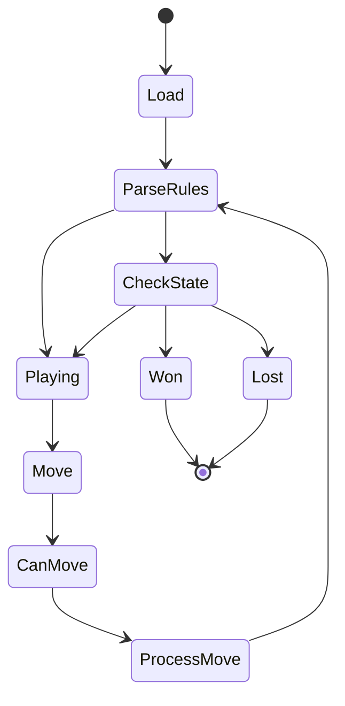

# Architecture

`baba-is-auto` artifacts are distributed and consumed in the following ways:

- A C++17 simulator library for use from C++.
- A `pyBaba` Python extension for scripting, tests, GUI playback, and RL examples.
- Python examples built on top of `pyBaba`, including pygame GUI playback and Gym-style reinforcement-learning environments.

## Overview

`baba-is-auto` simulates a subset of Baba Is You by loading a text map into a board, parsing active rules from word tiles, applying movement and object interactions, then exposing the resulting state to C++ and Python callers.

The core simulator lives in `Includes/baba-is-auto/` and `Sources/baba-is-auto/`. The Python binding in `Extensions/BabaPython/` mirrors that surface and links to the same C++ target. The GUI and RL directories are consumers of the Python API, not alternate simulator implementations.

### Phases

The simulator processes a game in five phases:

1. Load a map from `Resources/Maps` into `Map` cells.
2. Parse horizontal and vertical `NOUN IS NOUN/PROPERTY` rules from text tiles.
3. Move every object matching the active `YOU` rule when a caller supplies a direction.
4. Apply blocking, pushing, sinking, defeat, object stacking, and text movement through `Game`, `Map`, `Object`, and `RuleManager`.
5. Rebuild the active rules and report `PLAYING`, `WON`, or `LOST`.

### Board Representation

There are four main parts to the in-memory representation of a game:

- `Game`, in `Includes/baba-is-auto/Games/Game.hpp`, owns the current `Map`, active `RuleManager`, player icon, and play state.
- `Map`, in `Includes/baba-is-auto/Games/Map.hpp`, stores the initial and current board cells and loads fixture files.
- `Object`, in `Includes/baba-is-auto/Games/Object.hpp`, stores the object types stacked in a single cell and marks tiles that participate in active rules.
- `Rule` and `RuleManager`, in `Includes/baba-is-auto/Rules`, represent and query active rule triples.

Object, direction, play-state, noun, operator, property, and rule-direction values are shared through `Includes/baba-is-auto/Enums`. The `.def` files in that directory are part of the enum data model and should stay aligned with the enum helpers and bindings.

### Map File Format

Reusable map fixtures live in `Resources/Maps` as plain text files.

Each map starts with two integers:

1. Board width.
2. Board height.

The remaining values are read in row-major order and converted directly to `ObjectType` values. A map must provide exactly `width * height` object values after the dimensions.

Map files are intentionally small and mechanical. Prefer adding a minimal fixture that demonstrates one behavior over reusing a large scenario with unrelated rules.

### Module Map

The core C++ modules are grouped by domain:

- Games, in `Includes/baba-is-auto/Games` and `Sources/baba-is-auto/Games`, own map loading, board access, movement, rule parsing, and win/loss checks.
- Rules, in `Includes/baba-is-auto/Rules` and `Sources/baba-is-auto/Rules`, own rule storage, player discovery, and property checks.
- Agents, in `Includes/baba-is-auto/Agents` and `Sources/baba-is-auto/Agents`, provide `IAgent`, `RandomAgent`, and `Preprocess::StateToTensor` for learning examples.
- Enums, in `Includes/baba-is-auto/Enums`, define the shared vocabulary used by the simulator, Python bindings, GUI, and RL examples.

The generated aggregate header `Includes/baba-is-auto/baba-is-auto.hpp` is produced by `Scripts/header_gen.py` during the CMake build. Treat the individual headers as the source of truth.

### Behavior Contract

The simulator currently relies on these behavior contracts:

- `Game` is the canonical owner of turn progression.
- `Game::MovePlayer()` moves every object matching the active `YOU` rule.
- Text tiles are movable blockers during movement checks, even when they do not have an explicit `PUSH` rule.
- `STOP` prevents movement into a cell.
- `PUSH` recursively moves the object being pushed before the player moves.
- `SINK` and `DEFEAT` remove the moving object and can lead to `LOST`.
- Rules are rebuilt after every move, so moving text can immediately change the active rule set.
- The game is `LOST` when there is no active `YOU` rule or no object matching the current player icon remains.
- The game is `WON` when the player icon occupies a cell with an object that satisfies an active `WIN` rule.

When changing behavior, update the contract here if the observable simulator rules change.

### Python Extension

`Extensions/BabaPython` defines the `pyBaba` extension.

- `Extensions/BabaPython/Includes` contains one `Add*` declaration layer per exposed domain.
- `Extensions/BabaPython/Sources` contains the pybind11 implementations for enums, games, rules, and agents.
- `Extensions/BabaPython/main.cpp` composes the module by registering all exposed types and functions.

When simulator behavior changes in C++, check the matching binding files before calling the change complete. Python-visible behavior should be covered in `Tests/PythonTests` after the extension is built in place.

### C++ / Python Sync Checklist

For changes that affect public behavior, check these surfaces together:

- Core headers in `Includes/baba-is-auto`.
- Core implementation in `Sources/baba-is-auto`.
- Binding declarations in `Extensions/BabaPython/Includes`.
- Binding implementations in `Extensions/BabaPython/Sources`.
- `Extensions/BabaPython/main.cpp` when adding a newly exposed domain.
- Python GUI/RL enum or sprite mappings when adding object types.
- `Tests/UnitTests` for C++ behavior.
- `Tests/PythonTests` for Python-visible behavior.

Enum and object-type changes usually require the widest pass: `.def` files, enum helpers, pybind11 enum bindings, map fixtures, GUI/RL rendering maps, and tests should all be checked.

### Object Type Extension Guide

Adding a new icon, noun, operator, or property is a cross-cutting change. Treat the enum data as the starting point, then follow the value through the simulator, bindings, fixtures, and renderers.

For a new icon or noun:

1. Update the relevant `.def` file in `Includes/baba-is-auto/Enums`.
2. Check `Includes/baba-is-auto/Enums/GameEnums.hpp` for helper behavior such as text/icon conversion and type classification.
3. Check the Python enum bindings in `Extensions/BabaPython/Sources/Enums/GameEnums.cpp`.
4. Add or update C++ coverage in `Tests/UnitTests` when the new type affects simulator behavior.
5. Add or update Python coverage in `Tests/PythonTests` when the type is visible through `pyBaba`.
6. Update GUI/RL sprite mappings when the type can appear in rendered examples.
7. Add a minimal `Resources/Maps` fixture if an existing map cannot isolate the new behavior.

For a new property or operator:

1. Update the relevant `.def` file in `Includes/baba-is-auto/Enums`.
2. Check rule parsing and property classification in the enum helpers.
3. Implement the behavior in `Sources/baba-is-auto/Games/Game.cpp` or `Sources/baba-is-auto/Rules` as appropriate.
4. Mirror Python-visible enum changes in the pybind11 bindings.
5. Add focused C++ tests and Python tests for the new rule interaction.
6. Update GUI/RL text sprite mappings if the new word can appear in a level.

When adding sprite assets, keep them in the consumer that needs them:

- `Extensions/BabaGUI/sprites` for the standalone GUI.
- `Extensions/BabaRL/<environment>/sprites` for a specific RL environment.

Only duplicate sprite assets across environments when those examples actually render the new object or text.

### Consumers

There are three main Python consumers:

- `Extensions/BabaGUI` uses pygame and `pyBaba` to replay scripted actions with sprites.
- `Extensions/BabaRL` defines Gym-style environments, renderers, and DQN / REINFORCE examples for bundled levels.
- `Tests/PythonTests` validates Python-visible game, map, and rule behavior.

There is one main C++ consumer in the repository:

- `Tests/UnitTests` uses doctest against the `baba-is-auto` target and small map fixtures from `Resources/Maps`.

## Build Targets

The project is built through CMake and vcpkg.

- `Sources/baba-is-auto/CMakeLists.txt` builds the `baba-is-auto` library and runs the generated-header target.
- `Extensions/BabaPython/CMakeLists.txt` builds the `pyBaba` extension and links it to the core library.
- `Tests/UnitTests/CMakeLists.txt` builds the `UnitTests` executable and passes the `Resources/Maps` path as `MAPS_DIR`.
- `setup.py` drives extension builds for Python packaging.

## Visibility Rules

- Public C++ API belongs in `Includes/baba-is-auto/`.
- C++ implementation details belong in `Sources/baba-is-auto/`.
- Binding registration declarations belong in `Extensions/BabaPython/Includes`.
- Binding implementation details belong in `Extensions/BabaPython/Sources`.
- `pyBaba` should mirror the C++ domain surface instead of inventing separate Python-only simulator behavior.
- Keep class fields and helper functions private unless another module, test, or binding layer genuinely needs access.
- Do not hand-edit `Includes/baba-is-auto/baba-is-auto.hpp` as the source of truth.

## File Conventions

Core C++ files should stay paired by domain:

- `Includes/baba-is-auto/Games/*.hpp` with `Sources/baba-is-auto/Games/*.cpp`
- `Includes/baba-is-auto/Rules/*.hpp` with `Sources/baba-is-auto/Rules/*.cpp`
- `Includes/baba-is-auto/Agents/*.hpp` with `Sources/baba-is-auto/Agents/*.cpp`
- `Includes/baba-is-auto/Enums/*.hpp` and `.def` files for shared enum data

Python binding files should mirror the same domain names under `Extensions/BabaPython/Includes` and `Extensions/BabaPython/Sources`.

Reusable level fixtures belong in `Resources/Maps`. GUI and RL sprite changes belong in their extension-specific sprite directories unless a change is intentionally shared.

## Developing

All native development should go through CMake targets. Add or move C++ files only after checking the relevant `CMakeLists.txt`.

For simulator behavior changes:

1. Update the C++ core API and implementation together.
2. Check whether `Extensions/BabaPython` needs a mirrored binding update.
3. Add doctest coverage in `Tests/UnitTests`.
4. Add pytest coverage in `Tests/PythonTests` when Python-visible behavior changes.
5. Keep any reusable map fixtures small and place them in `Resources/Maps`.

For Python dependency changes, keep `requirements.txt` hash-pinned. Do not add unpinned dependencies for examples, tests, or tooling.

### Testing Matrix

Use the narrowest validation that covers the changed behavior:

| Change type                 | Suggested validation                                                     |
| --------------------------- | ------------------------------------------------------------------------ |
| Documentation-only          | Markdown review; no build required.                                      |
| Core C++ behavior           | Configure/build with CMake, then run `UnitTests`.                        |
| Python-visible behavior     | Build `pyBaba` in place, then run `Tests/PythonTests`.                   |
| Enum or object-type changes | Run C++ tests, Python tests, and manually check GUI/RL mappings.         |
| Map fixture changes         | Run the tests or examples that load the changed fixture.                 |
| CMake or packaging changes  | Reconfigure from a clean build directory and build the affected targets. |

### Essential Dependencies

The core project depends on:

1. CMake and vcpkg for portable native builds.
2. doctest for C++ unit tests.
3. pybind11 for the Python extension.
4. effolkronium_random for random-agent behavior.

The Python-facing examples and tests depend on the pinned packages in
`requirements.txt`, including pygame, Gym, NumPy, and pytest.
