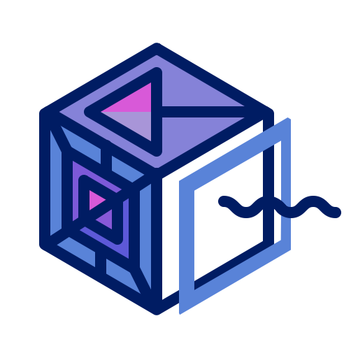
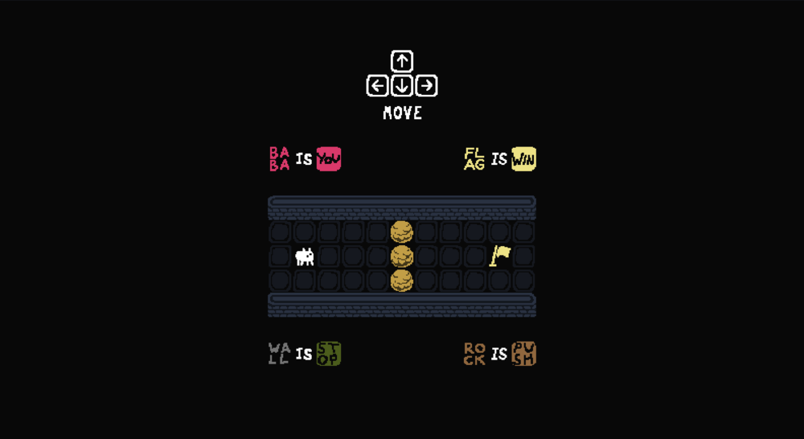
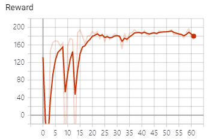
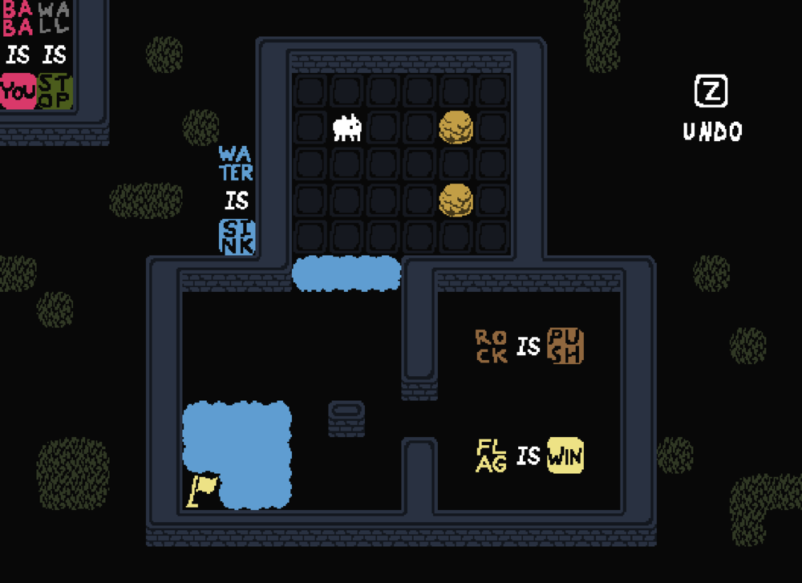
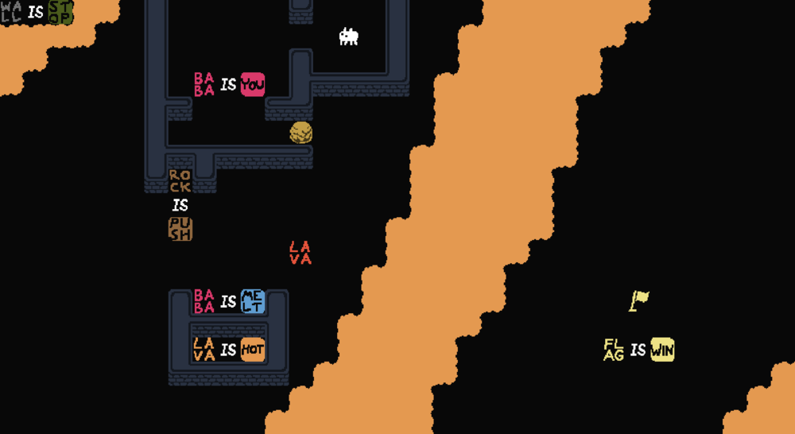

# baba-is-auto



[](https://github.com/utilForever/baba-is-auto/blob/master/LICENSE) [](https://travis-ci.org/utilForever/baba-is-auto/branches) [](https://ci.appveyor.com/project/utilForever/baba-is-auto/branch/master) [](https://utilforever.visualstudio.com/baba-is-auto/_build/latest?definitionId=8&branchName=master)

[](https://codecov.io/gh/utilForever/baba-is-auto)
[](https://www.codacy.com/manual/utilForever/baba-is-auto?utm_source=github.com&amp;utm_medium=referral&amp;utm_content=utilForever/baba-is-auto&amp;utm_campaign=Badge_Grade)
[](https://lgtm.com/projects/g/utilForever/baba-is-auto/alerts/)
[](https://lgtm.com/projects/g/utilForever/baba-is-auto/context:cpp)
[](https://www.codefactor.io/repository/github/utilforever/baba-is-auto)

[](https://sonarcloud.io/dashboard?id=baba-is-auto) [](https://sonarcloud.io/dashboard?id=baba-is-auto) [](https://sonarcloud.io/dashboard?id=baba-is-auto) [](https://sonarcloud.io/dashboard?id=baba-is-auto) [](https://sonarcloud.io/dashboard?id=baba-is-auto)

baba-is-auto is Baba Is You simulator using C++ with some reinforcement learning. The code is built on C++17 and can be compiled with commonly available compilers such as g++, clang++, or Microsoft Visual Studio. baba-is-auto currently supports macOS (10.14 or later), Ubuntu (18.04 or later), Windows (Visual Studio 2017 or later), and Windows Subsystem for Linux (WSL). Other untested platforms that support C++17 also should be able to build baba-is-auto.

## What is "Baba Is You"?

[Baba Is You](https://hempuli.com/baba/) is an award-winning puzzle game where you can change the rules by which you play. In every level, the rules themselves are present as blocks you can interact with; by manipulating them, you can change how the level works and cause surprising, unexpected interactions! With some simple block-pushing you can turn yourself into a rock, turn patches of grass into dangerously hot obstacles, and even change the goal you need to reach to something entirely different.

## Key Features

  * C++17 based Baba Is You library
  * Various RL environments based on OpenAI Gym
  * GUI simulator using `pygame`
  * C++ and Python API

## Environments

- Action Space
  - UP
  - DOWN
  - LEFT
  - RIGHT

- Reward
  - Failed : -100 points
  - Solved : +200 points
  - Each action : -0.5 points

### [baba-babaisyou-v0](./Extensions/BabaRL/baba-babaisyou-v0/environment.py)



#### Algorithms

- [REINFORCE](./Extensions/BabaRL/baba-babaisyou-v0/REINFORCE.py)

- [DQN](./Extensions/BabaRL/baba-babaisyou-v0/DQN.py)

  

### [baba-outofreach-v0](./Extensions/BabaRL/baba-outofreach-v0/environment.py)



### [baba-volcano-v0](./Extensions/BabaRL/baba-volcano-v0/environment.py)



## Quick Start

You will need CMake to build the code. If you're using Windows, you need Visual Studio 2017 in addition to CMake.

First, clone the code:

```
git clone https://github.com/utilForever/baba-is-auto.git --recursive
cd baba-is-auto
```

### C++ API

For macOS or Linux or Windows Subsystem for Linux (WSL):

```
mkdir build
cd build
cmake ..
make
```

For Windows:

```
mkdir build
cd build
cmake .. -G"Visual Studio 15 2017 Win64"
MSBuild baba-is-auto.sln /p:Configuration=Release
```

### Python API

Build and install the package by running

```
pip install -U .
```

### Docker

```
docker pull utilforever/baba-is-auto:latest
```

## Documentation

TBA

## How To Contribute

Contributions are always welcome, either reporting issues/bugs or forking the repository and then issuing pull requests when you have completed some additional coding that you feel will be beneficial to the main project. If you are interested in contributing in a more dedicated capacity, then please contact me.

## Contact

You can contact me via e-mail (utilForever at gmail.com). I am always happy to answer questions or help with any issues you might have, and please be sure to share any additional work or your creations with me, I love seeing what other people are making.

## Acknowledgement

I would like to thank [Arvi "Hempuli" Teikari](https://hempuli.com/) for allowing me to develop this project.

## License


The class is licensed under the [MIT License](http://opensource.org/licenses/MIT):

Copyright &copy; 2020 [Chris Ohk](http://www.github.com/utilForever).

Permission is hereby granted, free of charge, to any person obtaining a copy of this software and associated documentation files (the "Software"), to deal in the Software without restriction, including without limitation the rights to use, copy, modify, merge, publish, distribute, sublicense, and/or sell copies of the Software, and to permit persons to whom the Software is furnished to do so, subject to the following conditions:

The above copyright notice and this permission notice shall be included in all copies or substantial portions of the Software.

THE SOFTWARE IS PROVIDED "AS IS", WITHOUT WARRANTY OF ANY KIND, EXPRESS OR IMPLIED, INCLUDING BUT NOT LIMITED TO THE WARRANTIES OF MERCHANTABILITY, FITNESS FOR A PARTICULAR PURPOSE AND NONINFRINGEMENT. IN NO EVENT SHALL THE AUTHORS OR COPYRIGHT HOLDERS BE LIABLE FOR ANY CLAIM, DAMAGES OR OTHER LIABILITY, WHETHER IN AN ACTION OF CONTRACT, TORT OR OTHERWISE, ARISING FROM, OUT OF OR IN CONNECTION WITH THE SOFTWARE OR THE USE OR OTHER DEALINGS IN THE SOFTWARE.

Baba Is You was created by Arvi "Hempuli" Teikari, a Finnish game developer known for other titles such as *Environmental Station Alpha* and *Stumblehill*.